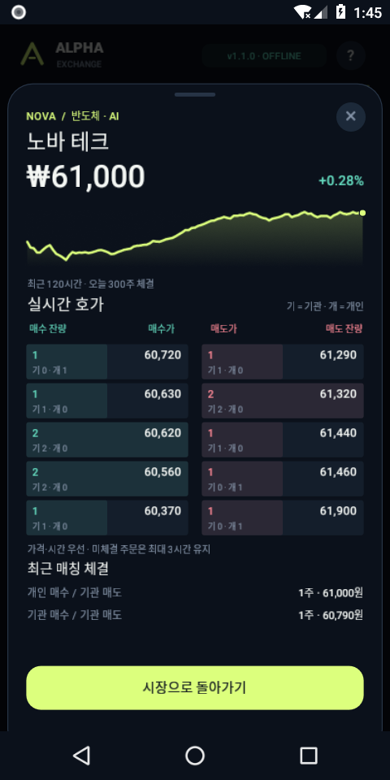

# ALPHA EXCHANGE · 알파 익스체인지

C#으로 만든 **완전 오프라인 주식 관찰 시뮬레이션**입니다. 기관 AI 100개와 개인 AI 10,000명이 호가를 내고 서로 거래합니다. 플레이어는 매매에 참여하지 않고 시장과 기관의 성적을 관찰합니다.

**[최신 릴리스](https://github.com/hddy774/project-hora/releases/latest)** · **[APK 다운로드](https://github.com/hddy774/project-hora/releases/latest/download/AlphaExchange.apk)** · **[소스·그래픽 ZIP](https://github.com/hddy774/project-hora/releases/latest/download/AlphaExchange-Source.zip)**

## v1.1.0

- **실제 호가 경쟁**: 가격·시간 우선 지정가 매칭, 부분 체결, 현금/주식 예약, 취소·만료, 자전거래 방지. 종목을 누르면 매수/매도 5단계 호가와 기관/개인 잔량, 최근 체결을 확인합니다.
- **100 기관 + 10,000 개인**: 기관의 초기 자산은 1,000만 원, 개인은 그 1/100인 10만 원입니다. 초기 자산은 현금과 주식으로 구성됩니다. 개인은 전원 독립된 자산 장부를 가지며 매시간 300~800명이 순환 참여합니다. 개인별 프로필이나 순위는 표시하지 않습니다.
- **재무제표**: 기관별 재무상태표·손익계산서·현금흐름표, 개인 전체/1인 평균 재무제표. 보유 종목, 평균 원가, 주문 예약액, 누적 수수료, 실현·평가손익을 확인합니다.
- **시장·분야 통계**: 유통 시가총액, 거래량/거래대금, 매수/매도 잔량, 상승/하락 종목 수, 기관·개인 자산 비교, 6개 분야별 가중 등락과 주식 보유 구성.
- **끝없는 시즌**: 30일마다 자동으로 다음 시즌으로 넘어갑니다. 시장과 자산은 계속 이어지고, 시즌 시작 자산 대비 수익률로 100개 기관 순위를 기록합니다. 동률은 고정 기관 ID 순서입니다. 시즌별 전체 성적과 각 기관의 과거 성적을 조회할 수 있습니다.
- **대표 인물 100명**: 여성 70명·남성 30명. 제공된 참고 이미지의 화풍을 바탕으로 현대 복장과 도시 배경의 서로 다른 인물을 직접 생성했습니다.

<p>
  
  
  
</p>

## 실행 및 시간

Android 8.0 이상 64비트 ARM 기기와 x86_64 에뮬레이터를 지원합니다. APK에는 그래픽과 C# 런타임이 들어 있으며 계정·서버·API 키가 필요 없습니다. 다운로드한 APK의 설치를 Android 설정에서 허용한 후 실행합니다.

하단 화면은 **시장 / 자산 / 기관 / 통계 / 시즌 / 뉴스**입니다. 기관을 선택하면 대표 그림, 포트폴리오, 재무제표, 시즌 성적을 볼 수 있습니다. 배속 버튼은 1→2→5→20 순서로 바뀝니다.

| 배속 | 게임 1시간 | 게임 1일 | 30일 시즌 |
|---|---:|---:|---:|
| 1× | 실제 5초 | 실제 120초 | 실제 60분 |
| 2× | 실제 2.5초 | 실제 60초 | 실제 30분 |
| 5× | 실제 1초 | 실제 24초 | 실제 12분 |
| 20× | 실제 0.25초 | 실제 6초 | 실제 3분 |

하루는 24시간이며 휴장 없이 거래합니다. 앱을 벗어나면 저장하고 일시정지하며, 닫힌 동안 시간은 진행되지 않습니다. 15초 간격, 시즌 전환, 일시정지 때 자동 저장합니다. 강제 종료 시 마지막 자동 저장 이후 최대 약 15초의 진행은 복구되지 않을 수 있습니다.

## 시장과 회계 규칙

8개 가상 기업과 6개 분야를 사용합니다. 기관은 모멘텀·가치·역추세·뉴스·분산·탐험의 6가지 전략을 사용하고, 개인은 추세와 뉴스에 단순하게 반응합니다. 모든 의사결정은 기기 내부의 C# 알고리즘이며 외부 생성형 AI나 실제 금융 시세를 사용하지 않습니다.

주가는 **상대 주문과 실제 체결될 때만** 변합니다. 뉴스와 기업 가치 추정은 주문 가격·방향에 영향을 줍니다. 체결 가격은 먼저 대기하던 주문의 가격입니다. 주식을 빌리거나 공매도하지 않으며, 보유 주식/현금을 초과하는 주문은 거부합니다. 취소·만료 시 예약을 해제합니다. 자동 주문의 유효 기간은 3시간입니다.

각 체결의 매수·매도자에게 0.15% 수수료(원 단위 올림)가 부과됩니다. 수수료는 거래소 계정에 모이므로 **참가자 현금 + 거래소 수수료는 보존**되고 종목별 총 주식 수도 일정합니다. 매입 원가는 수수료를 제외하며 수수료는 손익계산서에서 한 번 비용 처리합니다. 장기간 수수료 누적으로 참가자 유동성이 줄어들 수 있습니다.

재무제표는 시뮬레이션 시작부터 누적된 장부입니다. 순위만 매 시즌 새로운 시작 자산을 기준으로 계산합니다. 시가총액은 게임에 배분된 유통 주식 수로 계산하며, 시장/분야 등락률도 해당 주식 수로 가중합니다. 거래량은 매칭 수량을 한 번 계산하고 기관/개인 체결 참여 횟수는 양쪽 참가자를 각각 계산합니다.

## 저장과 업데이트

v1.0 APK와 같은 앱 ID와 서명으로 배포하여 덮어쓰기 업데이트를 지원합니다. 기존 `season-v2.json`은 원본을 남기고 v3 형식으로 이전합니다. 기관 ID·현금·보유 주식·거래 횟수를 유지하며, 이전 수수료·실현손익은 별도 필드에 보존합니다. 새 재무제표는 이전 시점의 자산을 기초로 시작합니다. 진행 중인 기존 시즌의 순위 기준은 기존 초기 자산을 유지합니다. 종료된 기존 시즌은 성적을 보관하고 시즌 2로 이어집니다.

현재 상태는 `market-v3.json`에 원자적으로 저장하며 직전 정상 저장본을 `.bak`으로 보존합니다. 완료 시즌의 100개 순위는 `seasons/<시장 ID>/season-XXXXXXXX.json`에 별도 보관합니다. 차트 120시간·체결 160건·뉴스 40건·기관별 최근 성적 12개만 메모리에 유지하고 이전 성적은 파일에서 페이지별 조회합니다. 시즌 수에 게임상 종료 한도는 없으며 기록을 보관할 기기 저장 공간은 필요합니다.

## 그래픽 소스

`src/AlphaExchange.Android/Assets/portraits/`에는 새로 생성한 인물 일러스트 **100개를 담은 PNG 아틀라스 10장**과 `manifest.json`이 있습니다. 각 그림은 약 307×512px이며 고유한 기관 ID·이름·성별·픽셀 영역·원본 SHA-256으로 식별됩니다. 서로 다른 기관이 같은 그림을 공유하지 않습니다. 자세한 내용은 [아트 설명](art/ART-DIRECTION-v1.1.0.txt)에 있습니다.

시작 화면의 `arena.png`와 과거 로봇 SVG는 v1.0 원본을 보존했습니다. 앱 UI·차트·아이콘은 C# Canvas와 Android 벡터로 그리며 한국어 시스템 글꼴을 사용합니다.

## 개발과 검증

GitHub에서 계획 → Draft PR → 개발·검증 → 병합 → 최신 릴리스 순서로 진행합니다. 기능 버전은 **1.1.0 → 1.2.0 → 1.3.0**처럼 가운데 숫자를 올립니다. [v1.1.0 계획](docs/PLAN-v1.1.0.md), [검증 결과](VERIFICATION.txt).

```text
src/AlphaExchange.Core/       호가·회계·AI·시즌·통계·저장
src/AlphaExchange.Android/    네이티브 화면·터치·인물 그래픽
tests/AlphaExchange.Checks/   체결·회계·시간·16시즌·복원 검증
scripts/check-artwork.py      인물 100개 구성·좌표·무결성 검사
.github/workflows/checks.yml  PR 및 브랜치 자동 검증
```

.NET SDK 9.0.318, Android workload, JDK 17, Android SDK Platform 35 / Build Tools 35.0.0이 필요합니다. 앱 호환성 대상은 API 34이며 최소 API 26입니다.

```bash
dotnet workload install android
export ANDROID_HOME=/path/to/android-sdk
export JAVA_HOME=/path/to/jdk-17
./build.sh
python3 scripts/check-artwork.py
```

검증만 실행하려면 `dotnet run --project tests/AlphaExchange.Checks -c Release`를 사용합니다. APK는 Android용이며 Unity·웹뷰가 필요 없습니다. 기본 로컬 빌드의 개발 서명은 배포 서명과 다릅니다. 배포 키·비밀번호는 저장소와 소스 ZIP에 포함하지 않습니다. 다른 키로 서명한 APK는 기존 배포 APK를 업데이트할 수 없습니다.
