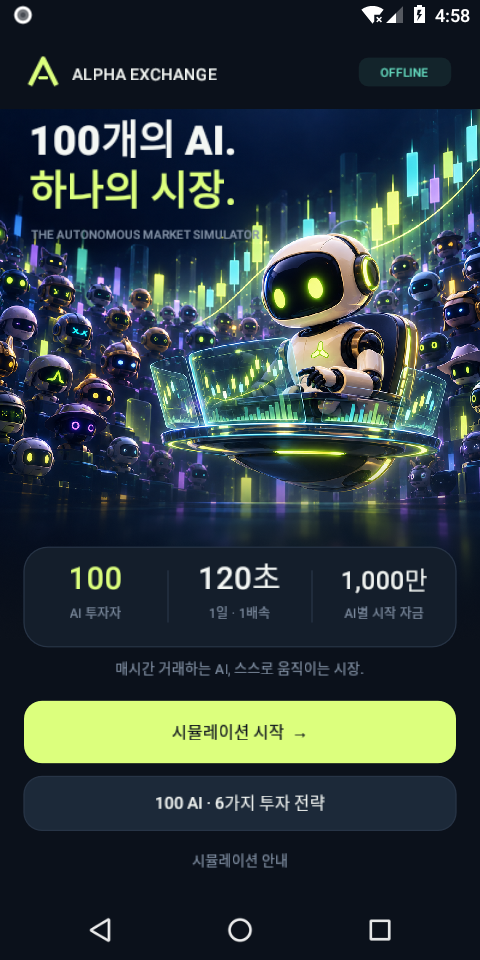
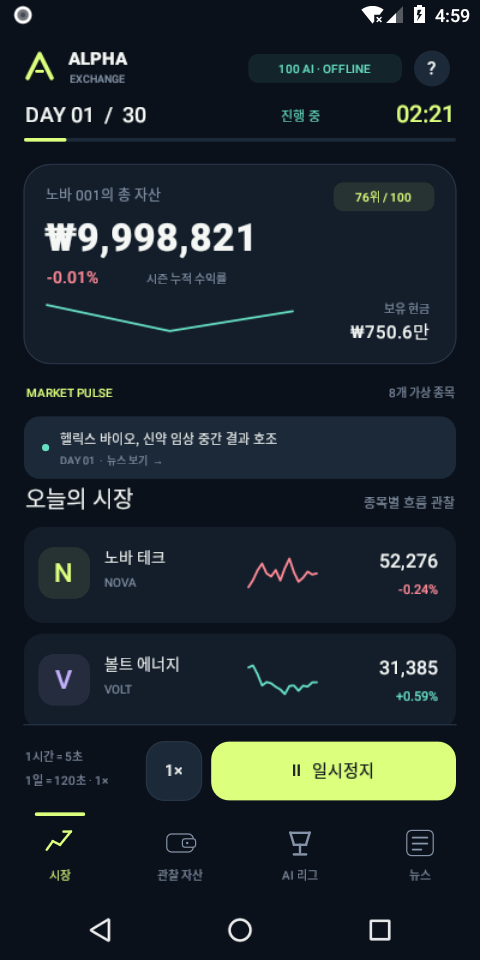
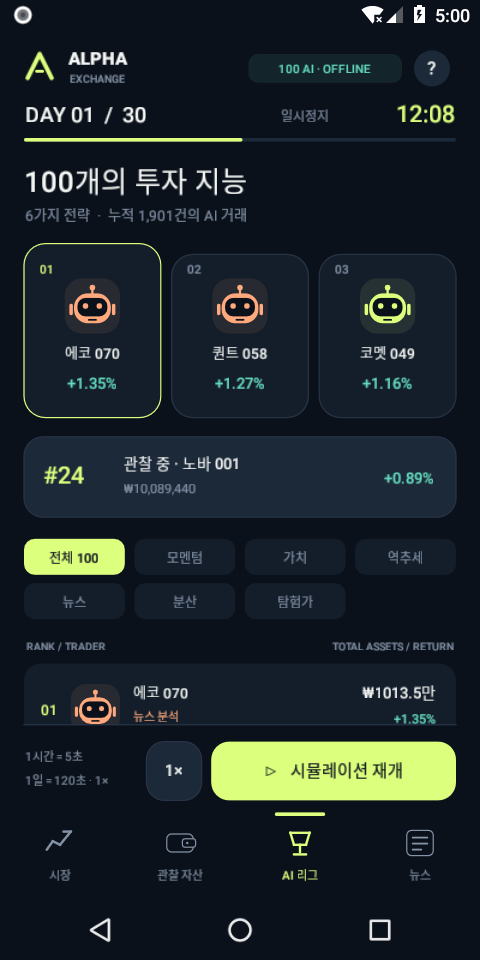

# ALPHA EXCHANGE · 알파 익스체인지

C#으로 구현한 **완전 오프라인 주식 관찰 시뮬레이션**입니다. 사용자는 매매에 참여하지 않습니다. 100명의 AI 투자자가 같은 초기 자금으로 경쟁하며 시장, 자산, 순위와 거래를 관찰할 수 있습니다.

## 다운로드

**[최신 릴리스](https://github.com/hddy774/project-hora/releases/latest)** · **[Android APK 바로 다운로드](https://github.com/hddy774/project-hora/releases/latest/download/AlphaExchange.apk)** · **[소스와 그래픽 ZIP](https://github.com/hddy774/project-hora/releases/latest/download/AlphaExchange-Source.zip)**

릴리스 APK에는 오프라인 실행에 필요한 그래픽과 C# 런타임이 포함되어 있습니다. `SHA256SUMS.txt`로 APK와 소스 ZIP의 무결성을 확인할 수 있습니다.

<p>
  
  
  
</p>

## 실행

- `AlphaExchange.apk`를 Android 8.0 이상, 64비트 ARM 기기에 설치합니다. x86_64 Android 에뮬레이터도 지원합니다.
- APK를 다운로드한 앱에 대해 Android 설정의 '이 출처의 앱 설치 허용'이 필요할 수 있습니다.
- 앱을 열고 **시뮬레이션 시작**을 누릅니다. 계정, 네트워크, API 키가 필요 없습니다.
- 하단의 **일시정지 / 재개**와 **1× / 2× / 5×**를 사용합니다.
- **AI 리그**에서 투자자를 누른 뒤 **이 AI의 포트폴리오 관찰**을 선택합니다.
- 앱이 백그라운드로 이동하면 저장하고 일시정지합니다. 앱을 닫은 동안 시간은 진행되지 않습니다.

## 시간 규칙

| 배속 | 게임 1시간 | 게임 1일 | 30일 시즌 |
|---|---:|---:|---:|
| 1× | 실제 5초 | 실제 120초 | 실제 60분 |
| 2× | 실제 2.5초 | 실제 60초 | 실제 30분 |
| 5× | 실제 1초 | 실제 24초 | 실제 12분 |

게임의 하루는 24시간입니다. 주말이나 휴장 없이 매시간 매매합니다. 단조 증가 시계로 실제 경과 시간을 누적하므로 프레임이 늦어지더라도 시간당 거래를 건너뛰지 않습니다. 일시정지 중에는 게임 시간이 흐르지 않습니다. 30일이 지나면 최종 평가 자산으로 우승자를 결정하고 새 시즌을 시작할 수 있습니다.

## AI와 시장

- **AI 100명, 플레이어 0명**. AI별 시작 자금 1,000만 원.
- 6가지 전략: 모멘텀, 가치 투자, 역추세, 뉴스 분석, 분산 투자, 탐험가.
- 투자자마다 이름, 전략, 위험 선호도, 인내심, 현금, 종목별 보유 수량, 평균 단가, 거래 내역을 독립적으로 관리합니다.
- 8개 가상 종목. 6시간마다 새로운 뉴스가 나오며, 가격에는 공개 뉴스·기업 가치·AI 순매수·확률적 변동이 반영됩니다.
- AI들은 현재의 공개 정보로 주문하며 미래 가격을 미리 보지 않습니다. 주문은 해당 시간의 동일한 현재가에 체결되고, 집계한 수급은 다음 가격에 반영됩니다.
- 거래마다 0.15% 수수료. 현금 부족, 음수 주문, 보유 수량 초과 매도는 거부합니다. 신용·공매도는 없습니다.
- 순위는 **현금 + 보유 주식의 현재 평가액**입니다. 거래 상대방은 가상 시장이며 AI끼리 주문을 직접 매칭하는 호가장 모델은 아닙니다.
- 최근 전체 1,200건의 체결과 최근 80개 뉴스가 보관됩니다. 전체 거래 건수와 시간별 자산 기록은 시즌 끝까지 유지됩니다.
- 'AI'는 로컬 의사결정 알고리즘입니다. 외부 생성형 AI 서비스나 서버를 호출하지 않습니다. 실제 주식·실제 자금과 무관한 가상 시뮬레이션입니다.

## 그래픽

- `src/AlphaExchange.Android/Assets/arena.png`: 이 프로젝트를 위해 직접 생성한 메인 3D 로봇 일러스트.
- `GameView.cs`: C# Canvas로 직접 그린 로봇 아바타, 차트, 아이콘, UI.
- `Resources/drawable/app_icon.xml`: 직접 제작한 벡터 앱 아이콘.
- `art/avatars/ai-001.svg` ~ `ai-100.svg`: 앱의 로봇 도형을 재사용 가능한 SVG로 내보낸 리소스. 전략별 색상과 여러 얼굴 변형을 공유합니다.
- 폰트는 Android 시스템 글꼴이며 한국어를 지원합니다. 네트워크로 받는 리소스가 없습니다.

## 소스 구조

```text
src/AlphaExchange.Core/        순수 C# 시장·AI·시간·저장 엔진
src/AlphaExchange.Android/     Android 앱·터치·그래픽·화면
tests/AlphaExchange.Checks/    시간·거래·저장·시즌 검증 실행기
art/                          원본 벡터 리소스와 아트 설명
build.sh                      로컬 APK 빌드
```

## 빌드

필수 도구: .NET SDK 9.0.318, .NET Android workload, JDK 17, Android SDK Platform 35와 Build Tools 35.0.0. `global.json`이 SDK 버전을 고정합니다.

```bash
dotnet workload install android
export ANDROID_HOME=/path/to/android-sdk
export JAVA_HOME=/path/to/jdk-17
./build.sh
```

기본 빌드는 로컬 개발 키로 서명합니다. 배포용 고유 키를 사용하려면 `dotnet publish`에 `AndroidKeyStore=true`, `AndroidSigningKeyStore`, `AndroidSigningKeyAlias`, `AndroidSigningStorePass`, `AndroidSigningKeyPass`를 지정하세요. 이 작업에서 전달한 APK의 서명 개인 키는 소스 압축 파일에 포함하지 않았습니다. 다른 키로 빌드한 APK로 바꾸려면 기존 앱을 제거해야 하며, 이 경우 저장한 시즌도 삭제됩니다.

```bash
dotnet run --project tests/AlphaExchange.Checks -c Release
```

Android 네이티브 앱이므로 Unity나 별도 게임 엔진, 웹뷰가 필요 없습니다. APK는 Android용이며 iOS 빌드는 포함하지 않습니다.
