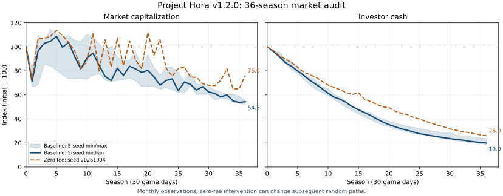

# v1.2.0 시장 축소 조사

조사일: 2026-10-04. 코드 기준은 main `e11579ac794f043c7b2cec10052746af9e5e6adf`이며, 시장 엔진은 배포된 v1.2.0과 같다. 이 문서는 현재 동작의 조사 결과다. 제안 기능의 구현 또는 Android 기기 성능 검증 결과가 아니다.

## 재현 결과

기관 100개·개인 10,000명·종목 10개의 기본 설정을 유지했다. 시드 5개를 각각 36시즌, 즉 1,080게임 일 / 25,920게임 시간 실행했다. 추가로 첫 시드에서 거래 수수료만 0으로 유지하는 비교 실행을 했다.

| 실행 | 시드 | 시가총액 변화 | 투자자 현금 변화 | 투자자 순자산 변화 |
|---|---:|---:|---:|---:|
| 기본 | 20261004 | -45.73% | -80.24% | -63.80% |
| 기본 | 42 | -45.90% | -81.17% | -64.33% |
| 기본 | 17 | -45.69% | -76.23% | -61.52% |
| 기본 | 20260308 | -45.11% | -78.83% | -62.85% |
| 기본 | 314159 | -48.11% | -80.08% | -64.85% |
| 수수료 0 | 20261004 | -23.97% | -73.99% | -50.17% |

원자료: [monthly.csv](analysis/v1.3.0/monthly.csv), [summary.json](analysis/v1.3.0/summary.json). 재현 방법: [MarketAudit](../tools/MarketAudit/README.md).

기본 실행 5개의 중앙값은 시가총액 -45.73%, 현금 -80.08%, 순자산 -63.80%다. 수수료를 없앤 실행에서도 현금과 시가총액이 감소했다. 따라서 거래 수수료를 낮추는 조치만으로 문제를 해결했다고 판단할 수 없다.

각 실행의 시작과 36개 월말, 총 222개 시점에서 다음을 검사했고 모두 일치했다.

- `투자자 현금 + 은행 현금 + 정부 현금 + 누적 수수료 = 초기 시스템 현금`
- 종목별 `투자자 실제 보유 수량 + 은행 대여 재고 = TotalShares`

이는 현금이 코드에서 사라지는 버그를 발견한 결과가 아니다. 현금이 투자자에게서 정부·거래소로 이동하고, 충분히 돌아오지 않는 구조가 관찰됐다. 주식의 평가액은 현금 보존식과 별개로 변한다.

## 현금이 이동한 곳

기본 시드 20261004의 투자자 현금은 1,062,107,500원에서 209,843,165원으로 줄었다.

| 계정 | 시작 | 36시즌 후 | 현금 순증감 |
|---|---:|---:|---:|
| 투자자 | 1,062,107,500 | 209,843,165 | -852,264,335 |
| 거래소 수수료 | 0 | 203,431,226 | +203,431,226 |
| 은행 | 1,000,000,000 | 1,000,339,377 | +339,377 |
| 정부 | 100,000,000 | 748,493,732 | +648,493,732 |

정부 순증가가 투자자 현금 감소액의 약 76.1%, 수수료가 약 23.9%에 해당한다. 정부 순증가는 세금·벌금·보조금의 합산 결과다. 이번 자료로 각각의 총유입·총유출을 분해하거나 벌금만의 기여도를 단정하지 않는다. 은행 순증가는 대출·상환·이자·대여료의 합산 결과이며 이자 총액과 같지 않다.

같은 실행에서 기업 장부상 자기자본은 약 193.33억 원에서 432.03억 원으로 증가했다. 36시즌 동안 기업 보고서에 표시한 배당 합계는 5,967,324,580원이다. 그런데 배당이 주주 계정에 지급되는 코드가 없으므로 이 수치는 투자자의 배당 수입이 아니다. 기업 이익·유보자본 증가와 투자자 수익이 분리되어 있다.

## 코드에서 확인한 개선 항목

우선순위 P0는 시장 축소·기록 공백의 원인 및 회계 기반, P1은 회사 확장과 기업행동, P2는 후속 확장이다. 코드는 조사 기준 커밋의 파일과 메서드를 기준으로 읽었다.

| ID / 우선순위 | 현재 동작과 근거 | 개선 방향 |
|---|---|---|
| M01 / P0 | [Economy.RefreshEconomy](../src/AlphaExchange.Core/Economy.cs)는 배당을 기업 현금에서 차감하지만 주주에게 지급하지 않는다. | 배당 지급을 실제 양쪽 장부에 기록하고 공매도 배당 보상도 정산한다. |
| M02 / P0 | [OrderBook.Execute](../src/AlphaExchange.Core/OrderBook.cs)는 양쪽 수수료를 `FeePool`에 누적한다. 지출 경로가 없다. | 거래소 운영비·임금·세금 등 예산 안의 환류를 만들고 유입/유출을 계측한다. 수수료를 임의 삭제하지 않는다. |
| M03 / P0 | [Economy.ServiceFinance / AssessFine](../src/AlphaExchange.Core/Economy.cs): 정부에 세금·벌금이 들어오고 주식 보조금만 제한적으로 나간다. | 세금·벌금·보조금·재정 지출을 분리하고, 정부 잔액과 정책 예산을 연결한다. 작전 실패 시 벌금 규칙은 유지한다. |
| M04 / P0 | 기업 영업현금흐름은 보고서의 순이익으로 생성되며 매출·원가·이자·세금의 상대 계정과 연결되지 않는다. 기업 현금도 현행 시스템 현금 보존식에서 빠져 있다. | 기업·실물경제를 포함하는 거래 장부, 생산·소비·재투자 모델로 확장한다. 기업 이익은 생산에 따른 가치 증가와 정산 결과로 계산한다. |
| M05 / P0 | 기업 초기 자산은 `20억 + 종목 인덱스 × 2억`, 주식 수는 초기 투자자 배분과 은행 재고로 정해진다. 장부 규모·주당 가치가 독립적이다. | 액면가·주식 수·자본금·기업 규모·주가의 단위를 맞춘다. 이전 저장의 주식이나 현금을 임의로 재배분하지 않는다. |
| M06 / P0 | `FairValue`는 매출 증감·마진·금리에만 조금 반응하고 초기 주가의 0.25~4배로 제한된다. 누적 유보이익과 주당 현금흐름을 직접 평가하지 않는다. | EPS·BPS·현금흐름·부채·사업 위험으로 평가하고 고정 초기 가격 제한을 제거한다. 적자와 침체도 가능하게 한다. |
| M07 / P1 | [GameEngine.DecideRetail](../src/AlphaExchange.Core/GameEngine.cs)는 `value`를 계산하지만 주문 판단에서 사용하지 않는다. 개인은 균일 확률로 종목을 고른다. | 개인도 성향에 따라 가치·배당·유동성·뉴스를 사용하고, 기관은 비용을 넘는 신호에 거래한다. |
| M08 / P0 | 양의 실현 거래마다 과세하며 손실과 상계하지 않는다. 횡보·등락 반복에도 세금이 누적된다. | 시즌 손익통산, 원천징수/환급·이월손실의 정책 선택을 명시한다. 거래 비용과 과세 기준을 화면에서 보여준다. |
| M09 / P1 | [GameEngine.Endow](../src/AlphaExchange.Core/GameEngine.cs)는 기관의 각 종목에 초기 자본의 평균 4.75%씩 배분한다. 정수화 전 10개는 평균 47.5%, 30개로 상수만 바꾸면 평균 142.5%다. | 총 투자 예산 안에서 종목·분야 가중치를 정규화한다. 실제 정수 주식 구입액을 검사하고 잔액을 현금으로 둔다. |
| M10 / P1 | 고정 `StockCount`, 배열 길이, 10개 뉴스 문구가 [GameEngine](../src/AlphaExchange.Core/GameEngine.cs)·[OrderBook](../src/AlphaExchange.Core/OrderBook.cs)·[Persistence](../src/AlphaExchange.Core/Persistence.cs) 등에 흩어져 있다. | 영구 SecurityId와 동적 카탈로그를 도입한다. 뉴스는 사업 특성과 ID로 선택하고 저장은 배열 위치에 의존하지 않는다. |
| M11 / P1 | `TotalShares`와 시가총액, 월 EPS·연환산 PER·PBR는 이미 있다. 발행·자사주·유통가능 수량 구분과 기업행동은 없다. | 기존 지표를 확장하고 정의를 통일한다. 주식 수 변경 전후의 보유·원가·공매도·차트·예약 주문을 함께 처리한다. |
| M12 / P0 | [History.Period](../src/AlphaExchange.Core/History.cs)는 원래 시작값과 최근 121일을 결합한다. [PortfolioAndStatistics](../src/AlphaExchange.Android/PortfolioAndStatistics.cs)는 그래프를 최근 일별 기록 이후로 제한한다. | 완료 시즌 일별 파일을 연결해 전체 조회를 먼저 고치고, 신규 시간별 기록은 영구 파일에서 조회한다. |
| M13 / P0 | [Persistence.GameStore](../src/AlphaExchange.Core/Persistence.cs)는 완료 시즌의 일별 통계를 파일에 저장한다. 현재 시간별 가격은 최근 120시간만 저장에 남는다. | 이미 있는 일별 기록은 복구·연결하고, 버려진 시간별 기록을 만들어내지 않는다. 앞으로 모든 게임 시간을 기록한다. |
| M14 / P0 | [GameView](../src/AlphaExchange.Android/GameView.cs)는 최신 상태 자동 저장을 병합한다. 모든 시간의 통계가 최신 상태에만 포함되면 중간 기록이 누락될 수 있다. | 기록 큐는 전부 추가하고 체크포인트만 병합한다. 기록과 복원 상태는 같은 트랜잭션으로 확정한다. |
| M15 / P1 | [CompanyFinancials](../src/AlphaExchange.Android/CompanyFinancials.cs)의 과거 분야 변화는 현재 주식 수를 과거 가격에 곱한다. | 각 시점의 주식 수와 기업행동을 함께 기록한다. 분할·증자로 과거 시가총액이 바뀌지 않게 한다. |

## 해석과 한계

주식은 기업의 미래 이익·현금흐름에 대한 소유권이다. 기업 생산성, 투자, 배당과 평가 변화로 투자자 전체가 수익을 얻을 수 있으며, 경기 악화나 손실로 전체가 손해를 볼 수도 있다. 거래에서 매수자와 매도자의 현금 이동이 보존된다는 사실은 주식 수익이 제로섬이라는 뜻이 아니다. 모든 주가를 매 시즌 올리는 보정도 해결책이 아니다.

이번 실행은 월말 보존 검사와 시장 경로 관찰이다. 시간마다 모든 주문·회계 불변식을 검사한 전체 테스트 결과로 취급하지 않는다. 분석에서 완료 시즌 대기 목록은 측정 후 비워 디스크 기록을 생략했으며 거래 입력에는 사용되지 않는다. UI, 앱 종료·복구, 통계 디스크 I/O는 이 실행에서 검사하지 않았다.

수수료 0 실행은 수수료 정책을 초기화하고 월말 주문 취소 뒤 다시 0으로 맞춘다. 다른 정책을 고정하거나 같은 뉴스 경로를 강제하지 않았다. 주문과 AI가 변하면 난수 소비도 달라진다. 따라서 기본 실행과의 차이는 엄밀한 인과 추정치가 아니다. 직접 확인한 장부 이동과 배당 미지급은 코드 근거로, 주가 하락에 대한 각 요소의 기여도는 후속 계측 과제로 구분한다.

## 후속 계측

1. 계정별 유입·유출을 수수료, 세금, 벌금, 이자, 대여료, 보조금, 임금, 소비, 배당으로 분리한다.
2. 실제 체결 가격, 적정가 추정, 스프레드, 회전율, 미체결량, 현금/담보 가용액을 함께 기록한다.
3. 뉴스·정책·주문 난수 스트림을 분리해 비교 실험의 외부 충격을 맞춘다.
4. 침체·회복·성장 시나리오에서 가격수익률과 배당 포함 총수익률, 최대 낙폭, 현금 분포를 따로 평가한다.
5. 기록 누락은 `RunId`·절대 게임 시간·해상도 기준으로 검사한다. 실제로 없는 구버전 기록은 부족한 범위를 표시한다.

상세 설계: [시장 시스템](MARKET-SYSTEM-v1.3.0.md), [통계 저장](STATISTICS-STORAGE-v1.3.0.md), [개발 계획](PLAN-v1.3.0-market.md).
