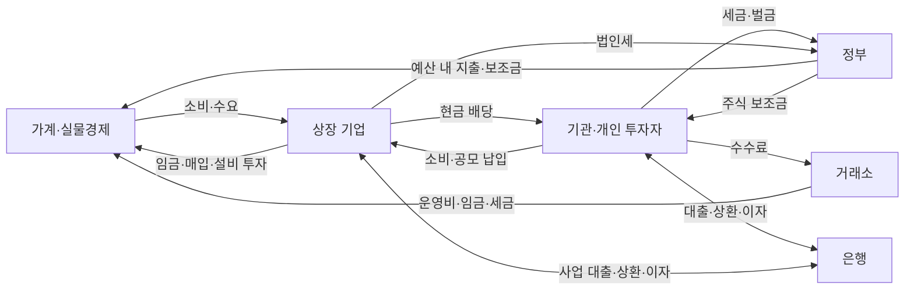

# v1.3.0 시장 시스템 설계

상태: 구현 전 제안. [현재 문제와 실측](MARKET-AUDIT-v1.2.0.md)을 기준으로 한다. 앱은 계속 오프라인 관찰 시뮬레이터이며 외부 시세, 서버, 생성형 AI, 플레이어 매매를 추가하지 않는다.

## 가치 창출과 자금 순환

기업은 상품·서비스를 생산하고, 판매 대금·비용·투자·이자·세금을 실제 상대 계정과 정산한다. 이익은 생산과 판매의 결과이며, 배당은 기업이 가진 현금을 주주에게 이전한다. 주식 매매 대금은 투자자 사이 이동이고 주가 평가는 미래 현금흐름과 위험에 따라 달라진다.

상장 기업 계정, 기존 투자자 계정, 은행, 정부, 거래소 및 비참가 가계·공급자를 집계한 `RealEconomySector`를 둔다. 집계 실물경제 계정은 기존 개인 10,000명의 현금을 다시 세지 않는다. 개인에게 지급할 임금·소비도 상대 계정이 있는 거래로 기록한다. 기업 사이의 매입·판매와 집계 계정 거래를 구분해 매출을 중복 계산하지 않는다.

첫 구현은 현금 거래와 명시적인 외상/부채만 지원한다. 생산 능력, 수요, 원재료비, 인건비, 재고, 감가상각, 설비투자가 실적을 결정한다. 감가상각은 현금 지출이 아니며 재고·고정자산을 소모한 비용과 현금 비용을 구분한다. 투자로 미래 생산 능력이 바뀌고, 악재·금리·경쟁·원가 충격은 손실과 현금 부족을 일으킬 수 있다.

모든 현금 거래는 `JournalEntry(TransactionId, RunId, Hour, Reason, From, To, Amount)`로 원자적으로 기록한다. 원 단위 정수 금액과 검증된 수량을 사용하고, 자산 평가액은 현금 거래로 기록하지 않는다.

- `전체 현금 = 투자자 + 모든 기업 + 은행 + 정부 + 거래소 + 실물경제 집계 계정의 현금`
- `기말 현금 = 기초 현금 + 실제 수취 - 실제 지급`
- `기말 기업 자기자본 = 기초 자기자본 + 순이익 - 배당 + 납입자본 변화 - 자사주 관련 감소`
- 주식 평가액과 그 주식이 대표하는 기업 자기자본을 더해 경제 전체의 순자산으로 중복 집계하지 않는다.

기업 보고서는 장부에서 생성한다. 기업 이자·세금은 은행·정부 수입과 대조한다. 외상 매출은 채권/채무로, 미지급 이자·임금은 부채로 남긴다. 기존 보고서에서처럼 현금 부족 때도 현금을 자동 생성하는 정산은 하지 않는다.

기본 모델의 총현금은 명시적인 기초 자원 안에서 순환한다. 통화 발행·중앙은행 모델은 후속 과제로 분리한다. 새 모델 초기화 때 기업과 실물경제의 기초 현금·실물자산·부채를 공개하고, v4 이전 시 새로 추적하는 기업 기초 잔액과 부채의 상대 계정을 명시한다. 이전 투자자에게 현금·무료 주식을 지급하거나 이를 투자 수익으로 기록하지 않는다.

## 정부·거래소·은행

정부는 시즌별 세금·규제·금리·보조금과 함께 지출 예산을 정한다. 세수와 벌금 일부를 정책에 따른 소비·투자·임금·보조금으로 집행하고 부족한 예산은 축소하거나 다음 시즌으로 미룬다. 자금이 없는 정부의 보조금은 지급하지 않는다. 거래소도 누적 수수료에서 운영비·임금·세금과 준비금을 배분한다. 환류 비율은 조정 가능한 정책이며 원인별 누적 유입/유출을 통계로 보여준다.

작전 실패 시 벌금 규칙은 유지한다. AI는 벌금 위험과 예상 비용을 판단에 포함하며 작전 재참여 간격·유동성 한도를 둔다. 벌금의 과도한 반복 여부를 계측하고 정부 지출로 이어지는 흐름을 보인다. 실패 벌금을 없애서 잔액만 맞추는 방식으로 수정하지 않는다.

투자자 매매 과세는 시즌 누적 실현 이익/손실을 바탕으로 한다. 정책이 지정한 세율로 원천징수하고 월말 차액을 정산/환급한다. 공매도는 상환 시 실현 손익을 반영한다. 이월손실 지원 여부와 배당 과세는 별도 정책 필드로 명시한다. 매매 손실, 거래 비용, 배당 수입, 외부 납입을 혼동하지 않는다.

은행은 기존 신용 등급·한도·대여 재고·담보를 유지한다. 기업 대출도 은행 현금과 대출 채권에 연결하며, 이자 미납·채무 조정은 장부에 남긴다. 금융 분야의 상장 회사 `BNKR`는 시스템의 대출/대여 서비스 `BankState`와 다른 법인으로 구분한다.

## 현실 용어와 지표

| 개념 | 게임에서의 정의와 적용 | 현재 / 계획 |
|---|---|---|
| 액면가·자본금 | 법정 기준 주당 액면가 × 발행주식 수. 시장 주가와 다른 값이다. 무액면 모델을 택할 경우 별도 표시한다. | 추가 |
| 발행주식 수 | 취소되지 않은 발행 총수. 자사주를 포함한다. | 기존 `TotalShares`를 명확한 필드로 이전 |
| 자사주 | 기업이 매입하여 보유한 자기 주식. 의결권·배당 대상에서 제외한다. | 추가 |
| 발행 중 주식 수 | `OutstandingShares = IssuedShares - TreasuryShares`. 주당 가치와 시가총액의 기준이다. | 추가 |
| 유통가능 주식 수 | 발행 중 주식에서 창업자/전략 보유·보호예수 등 제한분을 제외한 수량. 은행 대여 재고도 실제 상태에 따라 구분한다. | 추가 |
| 시가총액 | `평가 기준 가격 × OutstandingShares`. 유통가능 시가총액은 `가격 × FloatShares`로 별도 표시한다. | 기존 지표 확장·명칭 정리 |
| 거래량·거래대금·회전율 | 실제 체결 수량, 체결 가격 × 수량, 기간 거래량 / 기간 평균 유통가능 주식 수. | 기존 누적량에 기간/회전율 추가 |
| EPS·BPS | EPS는 최근 12개월 이익 / 기간 가중평균 발행 중 주식, BPS는 자기자본 / 현재 발행 중 주식. 분할은 비교 기준을 조정한다. | 현재 월 EPS·단순 연환산 개선 |
| PER·PBR | PER는 주가 / TTM EPS, PBR는 주가 / BPS. 이익 또는 자기자본이 0 이하이면 의미 없는 양수 배수 대신 `산출 불가` 표시. | 기존 지표 개선 |
| 배당성향·배당수익률 | 지급액 / 순이익, 최근 12개월 주당 배당 / 주가. 미지급 제안 배당과 실제 지급 배당을 구분한다. | 실제 정산 추가 |
| 가격수익률·총수익률 | 가격 변화만 계산한 수익률과 배당 재투자 가정 지수/실제 배당을 포함한 보유 성과를 구분한다. | 추가 |
| 호가·스프레드·유동성 | 최우선 매수/매도, 호가 간격, 체결 가능 수량과 회전율. 비유동 종목의 막연한 저평가 신호를 보정한다. | 기존 호가 데이터 활용 |
| 액면분할 | 같은 지분을 더 많은 주식으로 나눔. 수량 증가 자체는 수익이 아니다. | 추가 |
| 주식병합 | 여러 주식을 하나로 합침. 수량 감소 자체는 손실이 아니다. | 추가 |
| 기업합병 | 법인과 자산·부채가 결합하고 정해진 비율로 소유권을 교환함. 주식병합과 별개 사건이다. | 추가 |
| 유상증자·자사주 매입/소각 | 신주 납입은 회사로 자금 유입과 지분 희석, 매입은 회사 현금 지출, 소각은 발행 수 감소. | 기업행동 기반 이후 구현 |

TTM을 계산할 12개 결산이 없으면 `N개월 기준` 또는 `연환산 추정`이라고 표시한다. 금융·바이오 등 분야별 평가법 차이도 명시한다. 모든 기업을 같은 PER 목표에 강제로 맞추지 않는다.

시장 지수는 발행/구성 변경에 따라 제수를 조정한다. 단순 시장 시가총액은 실제 규모, 가격 지수는 구성 변화에 중립적인 가격 성과, 총수익 지수는 배당 포함 성과로 각각 제공한다. 증자·신규 상장이 시장 수익으로 계산되지 않게 한다.

## 기업 가치와 AI

기업 초기 규모는 주식 수·액면가·자본금·자기자본·수익력과 연결해 설정한다. 첫 가격은 해당 사업의 수익/자산 기반 평가 범위에서 시작한다. v4 저장의 초기 단위 불일치는 기업 기초 재무의 이전 규칙으로 처리하고 투자자 주가·보유 수량·취득 원가를 임의 재설정하지 않는다.

평가는 주당 정상화 이익·현금흐름, 장부자본, 부채, 사업 성장과 금리/위험 할인에 기초한다. 적자 기업은 자산·현금 소진·성장 가능성을 구분한다. 무한 성장률이나 0으로 나눔을 막되 기존 `StartPrice` 배수 범위로 시장을 고정하지 않는다. 적정가 추정은 평가 신호이고 실제 매칭 가격을 강제하는 값이 아니다.

기관은 기존 대표 10개 능력을 계속 사용한다. 가치 분석은 주당 실적·배당·평가 오차를, 거시 판단은 금리·정책·분야 경기와 부채 부담을, 위험 관리/분산 설계는 상관·집중·유동성·담보를 다룬다. 단타·초단타는 수수료·세금·슬리피지를 넘는 예상 이익과 체결 가능성을 판단한다. 공매도는 차입 비용·배당 보상·가격 상승 위험을 포함한다. 개인은 성향에 따라 가치·배당·추세·뉴스 가중치를 갖는다.

좋은 능력은 미래 뉴스나 다른 주문을 미리 보는 권한이 아니다. 같은 공개 정보에서 추정 오차, 의사결정 빈도, 비용 관리와 위험 대응이 달라진다. 하락장에서는 모든 기관의 동시 매도 대신 현금 여력과 능력별 매수/축소/헤지/상환 판단을 검증한다.

## 분야마다 5개 회사

[30개 회사 제안 카탈로그](COMPANIES-v1.3.0.csv)는 현재 6개 분야를 유지하고 기존 10개 회사에 20개를 추가한다. `company_id`는 신규 영구 ID 제안이며 기존 회사에는 심벌로 이전 매핑을 적용한다. 배열 인덱스는 저장 ID로 사용하지 않는다.

| 분야 | 기존 → 기본 구성 | 다섯 회사 심벌 |
|---|---:|---|
| 기술 | 3 → 5 | NOVA, AURA, CLUD, CYBR, DATA |
| 산업·에너지 | 2 → 5 | VOLT, ORBT, GRID, STEE, LOGI |
| 바이오·헬스 | 2 → 5 | HELX, CARE, PHAR, DEVC, DIAG |
| 금융 | 1 → 5 | MINT, BNKR, INSR, ASST, LEAS |
| 미디어 | 1 → 5 | WAVE, GAME, ADVT, STRE, PUBL |
| 소비재 | 1 → 5 | FOOD, RTAL, BEAU, APPL, TRVL |

사업별 원가, 수요 민감도, 투자·배당 정책과 뉴스 반응이 다르다. 같은 분야 뉴스는 공통 충격을, 회사 뉴스는 고유 충격을 주어 모든 회사가 같은 가격 경로를 복제하지 않는다.

신규 게임은 전체 투자 비중을 먼저 정하고 분야/회사별 가중치를 정규화해 정수 주식을 배분한다. 배분 합계가 자본을 넘을 수 없으며 반올림 잔액은 현금이다. 30개 각각에 기존 비율을 그대로 적용하지 않는다. 신규 회사의 발행 주식·창업자 지분·기업 기초 자산과 대여 재고의 소유자를 명시한다.

기존 게임에서는 새 회사를 IPO/카탈로그 편입 사건으로 등록한다. 기존 참가자는 현금을 내고 실제 상대에게 매수해야 하며 신규 주식을 무료로 받지 않는다. 공모 대금과 창업자 보유분을 구분한다. 회사 수 증가로 기존 시장 지수·투자자 수익률이 부풀지 않게 한다.

동적 `SecurityRegistry`가 영구 ID와 런타임 조회 위치를 매핑한다. 주문·뉴스·대여·보유·기업행동·과거 통계는 ID를 참조한다. 상장 종료 회사도 tombstone 정보와 과거 기록은 남는다. 성능 때문에 런타임 배열을 사용하더라도 길이는 카탈로그에서 정하고 저장에는 ID를 넣는다.

분야당 5개는 기본 상장 구성과 회복 목표다. 기업합병으로 한 분야가 일시적으로 4개가 될 수 있으며 현재 회사 수를 정확히 표시한다. 다음 시즌의 공모 절차로 5개를 회복한다. 합병 직후 같은 주식 수와 자산을 가진 회사를 무료 생성하지 않는다.

## 실제 배당

1. 월말 결산 뒤 이사회가 지급 여력 안에서 배당을 결정한다. 양의 순이익만으로 충분하지 않으며 최소 운영 현금·채무·보호된 자본을 먼저 검사한다.
2. 공지·권리 확정·배당락·지급 시각을 게임 시간으로 정한다. 첫 버전은 권리 확정과 배당락을 같은 거래 경계에서 처리해 미결제 거래 복잡도를 줄인다. 단계별 시각과 규칙은 UI에 명시한다.
3. 정수 총예산과 권리 주식 수로 주당 금액을 계산하고 잔액은 기업에 남긴다. 기업 현금 감소 = 주주 세후 현금 증가 + 배당세 정부 증가가 정확히 일치한다. 자사주는 권리가 없다.
4. 공매도로 매수한 실물 주식의 보유자가 기업 배당을 받는다. 대여 중인 은행 지분의 경제적 배당은 공매도자가 은행에 보상하고 기업이 같은 주식에 두 번 지급하지 않는다. 가용 현금 부족은 취소·담보 조정·대출/미지급 배당 부채에 명시적으로 반영한다.
5. 배당락은 기준 평가 가격의 조정 사건으로 기록한다. 실제 체결 가격은 주문 매칭으로 결정된다. 현금 지급과 가격 조정을 합친 총수익에서 배당을 두 번 더하지 않는다.

배당 수입·배당세·공매도 배당 비용·배당 미지급 부채를 참가자 손익/현금흐름과 신용 판단에 추가한다. 월별/TTM 보고서, 배당 수익률, 현금 구성 원형표에도 같은 정산 데이터를 사용한다.

## 분할·병합·기업합병

기업행동은 `EventId + SecurityId + EffectiveHour`로 한 번만 적용한다. 거래 경계에서 관련 주문을 취소하고 예약액을 해제한 뒤, 소유권·원가·대여·부채·가격 기준·차트 이벤트·저장을 한 묶음으로 처리한다. 진행 중 실패하면 모두 이전 상태로 복구한다.

| 사건 | 필수 처리 | 보존·검증 기준 |
|---|---|---|
| k:1 액면분할 | 발행·자사주·보유·대여·공매도 수량 ×k, 주당 원가·참조 가격·주당 지표 ÷k, 액면가 조정 | 지분율, 총 취득 원가, 주식 평가액, 기업 자기자본은 동일. 수량 범위 검사. |
| 1:k 주식병합 | 정수 수량과 단주 권리를 유리수로 계산하고 지급 재원에서 단주를 현금 정산 | 단주를 삭제하지 않음. 계정별/전체 정산과 원가·공매도 상환 의무 보존. |
| A+B 주식 교환 합병 | 사전에 공개한 교환 비율, A/B 자산·부채 승계, 신규/존속 주식 발행과 단주 정산, 기존 ID 거래 종료 | 교환만으로 자산·부채가 증발하거나 무료 수익이 생기지 않음. 이후 가치 재평가는 별도 시장 사건. |
| 유상증자 | 납입자 현금 감소·기업 현금/납입자본 증가·신주 증가·공모 조건과 희석 기록 | 기존 투자자에게 무료 배분하지 않음. 순자산/지수에서 외부 납입을 수익으로 계산하지 않음. |
| 자사주 매입/소각 | 실제 거래로 매입, 기업 현금 지출·자사주 증가, 별도 소각 시 발행 수 감소 | 매입 때 발행 총수는 그대로. 소각 때 자사주와 발행 수를 같이 감소. |

수량은 반복 분할에도 안전한 `long`과 checked 연산을 사용한다. 단주 청구권과 교환 비율은 정수 분자/분모로 보관하고 순서에 따라 결과가 달라지지 않는 정산 규칙을 정한다. 가격 최소값·호가 단위·원가 정밀도도 분할 가능한 범위로 함께 바꾼다. 기존 100원 최저 가격을 유지한 채 분할 가격을 잘라 시가총액을 늘리지 않는다.

병합의 단주에는 기업이 실제 준비한 현금을 사용한다. 준비금 부족 시 사건을 연기한다. 공매도 단주 의무는 대여자의 권리와 대조해 상환/현금 지급한다. 단주를 처리한 뒤 발행 수와 모든 실물 소유자 수량이 다시 일치해야 한다. 현금 합병, 분사, 다중 합병, 상장폐지 청산은 기본 주식 교환 합병 이후 별도 과제로 둔다.

원래 체결 가격과 거래량은 수정하지 않는다. `LastTradePrice`와 기업행동 후 `Reference/MarkPrice`를 구분한다. 실제 체결 없이 기준 가격이 조정되는 경우는 기업행동으로 표시한다. 수정 주가 차트는 분할·병합을 반영하고 원본 차트와 이벤트를 함께 제공한다. 기업행동을 가짜 체결로 넣어 거래량을 만들지 않는다.

`실물 보유 + 은행 재고 + 창업자/제한 보유 + 자사주 = 발행 총수`를 검사한다. 공매도 상환 청구권은 실물 발행 수에 다시 더하지 않는다. 발행 중·유통가능 수량은 해당 정의의 소유자 분류로 산출한다.

## 화면과 비교

종목 목록은 분야별 5개 회사와 현재 시총·거래대금·배당수익률·주식 수를 비교한다. 상세 화면은 기존 5종 재무제표에 발행/유통/자사주, TTM 지표, 권리·분할·합병 이력과 영업 지표를 연결한다.

통계는 가격 지수·총수익 지수·시가총액·기업 이익·투자자 순자산·가용 현금을 별도 축/단위로 표시한다. 표·선/막대 그래프는 증감과 음수를, 원형표는 양수 구성 비율을 표시한다. 전체·시즌·10일·5일·전일·임의 기간의 시작값/끝값/배당/비용을 같은 데이터에서 계산한다.

재무 5종, 배당, 기업행동과 모든 기간 통계는 [영구 통계 파일 설계](STATISTICS-STORAGE-v1.3.0.md)를 사용한다. 각 과거 시점의 주식 수와 기업 ID를 보관해 현재 회사 목록으로 과거 시가총액을 다시 계산하지 않는다.
