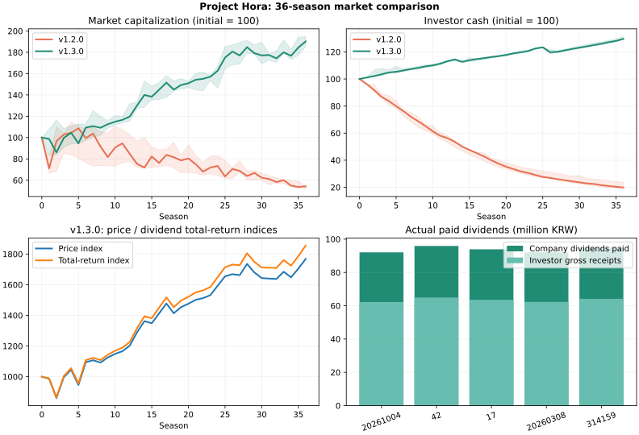

# v1.3.0 구현 후 시장 분석

기존 v1.2.0 원자료는 `../v1.3.0/`에 그대로 보존한다. 신규 게임 30개 회사와 현금 순환·실제 배당·기업행동 과세를 구현한 경제 코드 `2457f5451454071a291e69806bf78f22c380d203`에서 실행했다. 이후 UI·문서·구버전 지수 이전 수정은 이 신규 게임 실험의 거래/경제 규칙을 바꾸지 않는다.

```bash
dotnet run --project tools/MarketAudit -c Release -- artifacts/market-audit-v130 36
python3 tools/MarketAudit/compare.py
```

| 초기값 | 36시즌 시총 증감 | 투자자 현금 증감 | 순자산 증감 | 가격 지수 | 총수익 지수 | 기업 배당 지급 | 하락 시즌 |
|---|---:|---:|---:|---:|---:|---:|---:|
| 20261004 | 94.87% | 31.42% | 57.42% | 1836.14 | 1924.64 | 92,053,479원 | 14/36 |
| 42 | 85.34% | 29.66% | 51.83% | 1736.19 | 1820.28 | 95,908,032원 | 15/36 |
| 17 | 88.94% | 29.33% | 53.94% | 1749.74 | 1834.92 | 93,896,555원 | 15/36 |
| 20260308 | 92.58% | 29.40% | 55.54% | 1780.94 | 1867.87 | 92,052,261원 | 10/36 |
| 314159 | 90.27% | 30.17% | 55.06% | 1768.14 | 1855.15 | 94,891,084원 | 13/36 |
| 20261004 (수수료 0) | 91.70% | 37.42% | 59.14% | 1780.46 | 1868.05 | 95,657,214원 | 10/36 |



5개 기본 시드와 첫 시드의 수수료 0 비교를 각각 25,920시간 실행했다. 222개 시작/월말에서 투자자·기업·은행·정부·거래소·실물 경제의 총 현금과 참가자·은행·창업자·자사주의 실물 주식 보존을 검사했다. `system_cash_difference`는 모든 행에서 0이다.

시총은 발행 주식에서 자사주를 제외한 당시 주식 수를 사용하며 IPO/증자로도 달라질 수 있다. 가격 지수는 이 수량 변화 효과를 조정한다. 기업 배당 지급은 창업자·은행도 포함한다. 투자자 수취 배당과 공매도 대체배당은 별도 계정으로 기록하므로 기업 지급액과 투자자 수취액을 같다고 보지 않는다.

투자자 순자산 증감에는 임금·소비 순유입도 들어 있다. 이를 투자 수익률로 해석하지 않는다. `net_contributions`가 외부 순유입, 가격/총수익 지수가 상장·수량 효과를 조정한 시장 성과이며 기관 수익률은 유출입을 제외한 시간가중 방식이다.

원래 v1.2.0은 10개 회사, 이번 신규 게임은 30개 회사와 다른 초기 시스템 자원을 사용한다. 같은 시드도 규칙 변경으로 난수 소비와 거래 경로가 달라지므로 버전 간 차이는 통제된 인과 추정이 아니다. 모든 시즌/시드에서 상승을 보장하지 않으며 월별 하락도 관찰됐다.

이 경제 실행은 SQLite I/O와 Android 성능을 재는 검사가 아니다. 5년 합성 기록·강제 종료·쓰기 실패·이전·파일 복원과 앱 실행은 [검증 기록](../../../VERIFICATION.txt)과 [개발 진행표](../../DEVELOPMENT-v1.3.0.md)에 별도로 기록한다.
